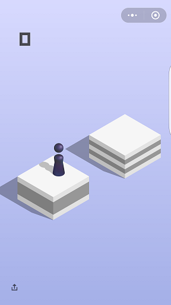

# 微信小游戏跳一跳

## 游戏原理

每次需要通过点击屏幕来控制小人跳到下一个砖块，点击时间的长短会控制小人跳的远近，跳到砖块正中心有额外的bonus, 有些特殊的砖块会有额外的bonus，像音乐盒，便利店这样的。

## 算法原理
>当前帧画面作为输入，提取小人和目的方块的位置，计算这两个位置之间的距离，然后转换成点击屏幕的时间，然后点击，循环。

### 环境配置
- Python2.7
- [Adb 驱动](http://www.mz6.net/news/2016-03-07/4506.html)
- [opencv3.2](https://opencv.org/)
- 三星S7Edge

### 操作说明
插入手机，确保`Adb工具`已经连接上手机，即`ada devices`能找到设备id，运行`main.py`，然后看着它玩即可。

### 文件说明
- `location.py` ： `get_dist()`负责检测小人坐标`person_cor`，目的砖块`dst_cor`；`dist2time`负责把小人和目的砖块之前的距离转化成时间。
- `main.py`： `jump()`和`get_screen()`封装了`Adb`的工具，完成截取手机屏幕和按指定时长点击屏幕2个动作。

##  Tips:
1. 有几种情况目的地检测会失效
	- 目的砖块过小  
	- 在特定的背景和砖块颜色下，会检测不到砖块，目的砖块坐标也会失效。
	
2. 在控制方面，参考了@[wangshub](https://github.com/wangshub/wechat_jump_game)的做法,用adb来控制。我和[冬强](https://github.com/cdq4817)最开始是打算用机械臂来完成，机械臂如下图，硬件方面的控制调试组装都是冬强完成的，后续等他回来我们可能会完成这个用硬件实现的跳一跳。

3. 鉴于1，所以你能玩到多少分全凭运气，是从几十到几千的均匀分布。